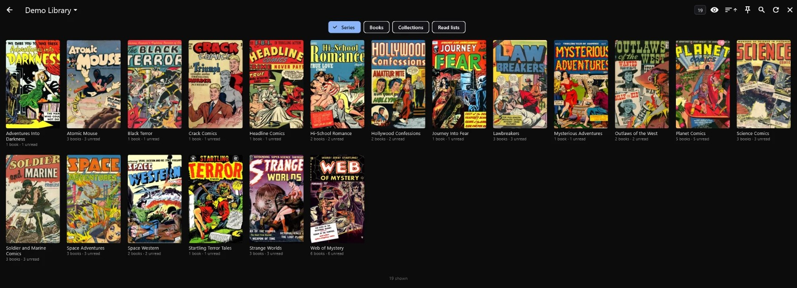
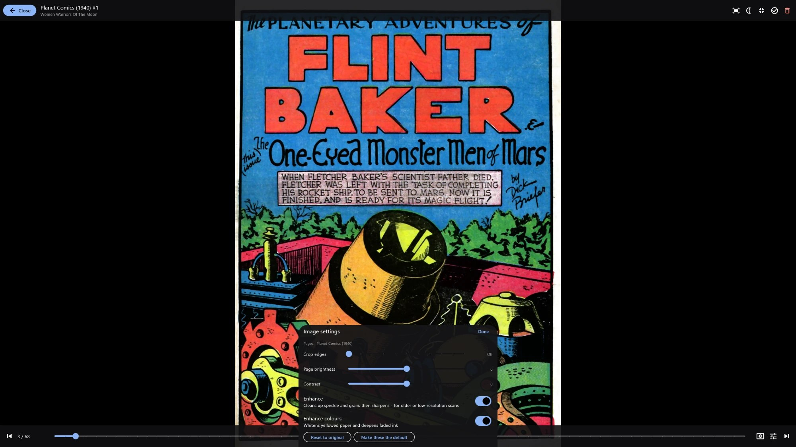

# BeDeReader

**A library and reader for [Komga](https://komga.org)** - comics, BD and manga from your own server.

[](#credits-and-licence)
[](LICENSE)

For an Android tablet or phone, a Windows PC, or a web browser. Browse your libraries with proper posters, read with
touch, keyboard, mouse or a remote page-turner, take books with you offline, and make old scans look their best.

BeDeReader is a client: your comics, reading progress, read lists and collections all stay on the Komga server.
This app shows them and keeps everything in sync.






*The screenshots show public-domain comics from the 1940s and 50s (Planet Comics, Web of Mystery and others).*

## What it does

**Browsing**
- **Home**: Continue reading, On deck, pinned views, your libraries, and optional rows for recently read, recently
  added and recent releases - each can be shown, hidden and rearranged.
- **Libraries, series, books, collections and read lists** as poster grids that load as you scroll, with sorting, a
  *Hide read* toggle, item counts and pull-to-refresh.
- **Search** across series, books, read lists and collections.
- **Pins**: save any view (a library, a series, a read list with read books hidden...) to Home under your own name.
- **Details** for books and series: summary, credits, publisher, genres and more.
- Mark books, whole series or read lists as read or unread; select several books at once; hide books or series from
  On deck.

**Reading**
- Fit to screen, width or height; pinch, double-tap or Ctrl+wheel to zoom; a zoomed-in page is read across and down
  before turning.
- Tap the sides, swipe, use the arrow keys, the mouse wheel, a remote or (on Android) the volume keys. Page turn
  animation: none, a wipe, or a 3D page curl that follows your finger.
- A page slider with a preview of the page you're picking.
- Right-to-left books (manga) follow Komga's reading direction, or your own setting per series.
- **Image settings per series**: Crop edges, brightness, contrast, **Enhance** (cleans up speckle and grain, then
  sharpens - on the graphics chip, once per page) and **Enhance colours** (whitens yellowed paper, deepens faded ink).
- Night mode (warm tint), a brightness slider that can go darker than the screen's minimum, a black, grey or white
  background, and the screen kept on while reading if you want it (for a few minutes after each page, or always).
- At the end of a book: the next one in the series or read list, with its poster.

**Offline**
- Download single books, or a series or read list's unread (or all) books, with a storage limit; optionally deleted
  once read.
- Offline mode shows just your downloaded books - by hand, or offered automatically when Komga can't be reached.
- Reading done offline is sent to Komga when it's back; if you also read elsewhere, the further position wins.

**On the PC**
- Right-click menus, keyboard shortcuts, remembered window size and position, full screen (F11) that stays on
  across books.

## Getting started

1. In Komga's web interface, create an API key: your account (top right) > API keys > Create.
2. Install the app:
   - **Android**: install `BeDeReader-<version>-android.apk` (allow installs from this source when asked).
   - **Windows**: unzip `BeDeReader-<version>-windows.zip` anywhere and run `BeDeReader.exe`.
   - **Web**: serve the contents of `BeDeReader-<version>-web.zip`; Komga has to allow requests from that address
     (CORS).
3. Enter your Komga address (for example `http://192.168.1.10:25600`) and the API key.

## Where your settings live

- **On Komga, for every device**: reading progress, per-series reader and image settings and their defaults, pins,
  and what's hidden from On deck.
- **On this device**: the server address and API key, screen brightness and night mode, how the reader behaves (page
  turn animation, taps, volume keys, background, keeping the screen on), poster size, Home's layout, remembered
  filters and sort orders, downloads and the offline mode switch. Settings > About can reset all of these at once.

Settings (side menu) has everything in one place, each section labelled with where it's kept.

## Privacy

- The app talks only to **your own Komga server**. No analytics, no tracking, no accounts, no ads.
- The one exception is the **web version**, which loads a font from Google's servers when it starts.
- Your server address and API key are stored **on the device, unencrypted** (the app's private storage on Android;
  your Windows profile on a PC). Encrypted storage is planned. Anyone with that API key can use your Komga account:
  you can revoke it any time in Komga (your account > API keys).
- On Android the app allows plain `http://` connections, so it can reach a Komga server on your home network that
  has no HTTPS. On a network you don't trust, use HTTPS.

## Remote page-turners

Bluetooth remotes that send arrow keys and Enter work throughout the app: arrows move between items, OK opens. In
the reader, OK shows the controls, Left/Right turn pages, and Back closes the controls, then the book.

## Credits and licence

Made by **Nick Perusse** 🍁.

BeDeReader is free software under the **MIT licence** (see `LICENSE`): use it, change it and share it, keeping the
copyright notice.

It's an independent app, not part of the Komga project. [Komga](https://komga.org) is free, open-source software
(MIT) by Gauthier Roebroeck (gotson) and contributors. The app is built with [Flutter](https://flutter.dev), and its
page enhancement adapts AMD FidelityFX Super Resolution 1 (MIT). Everything the project relies on - libraries, fonts,
build tools - is listed, with the notices they require, in `THIRD_PARTY_NOTICES.md` (in the app: About >
Third-party software). What's new in each build is in `CHANGELOG.md` (About > What's new).

**AI usage:** this application was developed with the aid of AI coding tools, but was designed, reviewed, and
tested by a human.

## Feedback

Bug reports and ideas are welcome as [GitHub issues](https://github.com/akajimmy/bedereader/issues). The project
doesn't take pull requests.

## For developers

The rest of this file is about building the app.

### The repository

- `komga_reader\` - the Flutter app: Dart in `lib\`, shaders in `shaders\`, tests in `test\`, native code in
  `android\` and `windows\`.
- `CHANGELOG.md` - what each build contains. `README.md` - this file. `THIRD_PARTY_NOTICES.md` - everything the
  project relies on, and the notices it must carry. All three are bundled into the app by the build.
- `LICENSE` - MIT.
- `tools\build.ps1` - the build pipeline; `tools\install-android.ps1` - installs on the tablet over wireless ADB;
  `tools\update-desktop.cmd` - puts the newest Windows build in `Desktop\BeDeReader`.
- `tools\make_icon.py` - draws every app icon from one set of shapes.
- `keytest\` - a page for finding out which keys a remote sends.
- `dev_setup.py` - downloads and verifies the toolchain.

### Toolchain (this PC)

Nothing is on PATH; the build script sets it up itself.

| What | Where |
|---|---|
| Flutter 3.47 | `C:\Dev\flutter` |
| JDK 17 | `C:\Dev\jdk17` |
| Android SDK | `C:\Dev\android-sdk` |
| Visual Studio Build Tools 2022 (C++) | for Windows builds |
| Windows Developer Mode | on (needed for plugins) |

For an interactive shell:

```powershell
$env:JAVA_HOME = 'C:\Dev\jdk17'; $env:PATH = "C:\Dev\flutter\bin;$env:PATH"; Set-Location C:\Claude\KomgaClient\komga_reader
```

Everyday commands, from `komga_reader\`:

```powershell
flutter analyze            # static checks
flutter test               # the test suite
flutter run -d windows     # run on this PC with hot reload
```

### Building

```powershell
powershell -ExecutionPolicy Bypass -File C:\Claude\KomgaClient\tools\build.ps1 -Bump
```

(Windows blocks `.ps1` scripts by default; `-ExecutionPolicy Bypass` lifts that for this one run without changing any
setting. The same goes for the other scripts in `tools\`.)

Checks the working tree is committed, runs analyze and the tests (stopping on any failure), raises the build number,
files the changelog's *Unreleased* entries under the new build, bundles the README, changelog and third-party notices
into the app,
builds Android, Windows and web into `dist\<version>\` with checksums and a BUILD-INFO.txt, then commits and tags
`build-<n>`. If a build fails, the version, changelog and bundled documents are put back.

Options: `-Platforms android` (or `windows`, `web`) builds a subset; `-SkipTests` skips the tests; `-NoInstall`
skips the tablet and the Desktop copy; `-AllowDirty` allows uncommitted changes (for a throwaway build). Progress is in
`dist\build.log`.

After a Windows build the app is unzipped over `Desktop\BeDeReader`, the copy used on this PC (your settings and
downloads aren't in that folder, so nothing is lost). If the app is open from there, that step is skipped and says
so: close it and run `tools\update-desktop.cmd` (or double-click it).

After an Android build the APK is installed on the paired tablet over wireless ADB. Pairing is a one-time step:
`& 'C:\Dev\android-sdk\platform-tools\adb.exe' pair <IP>:<port>` with the code from the tablet's Settings > Developer
options > Wireless debugging > Pair device with pairing code. Wireless debugging must be on for installs (Android
switches it off whenever the tablet leaves the Wi-Fi); if the tablet can't be reached the build still succeeds and
says so - install later with `tools\install-android.ps1`.

**Release signing (Android):** `komga_reader\android\key.properties` (copy `key.properties.example`; never
committed) names the keystore, which lives outside the repository. Its password is kept encrypted with your Windows
account in `%USERPROFILE%\.keystores\android-release.pass` - make it once with
`Read-Host 'Keystore password' -AsSecureString | ConvertFrom-SecureString | Set-Content "$env:USERPROFILE\.keystores\android-release.pass"`.
The build decrypts it for the Android build only, then checks which key actually signed the APK (in the log and
BUILD-INFO.txt). Without the keystore or password it falls back to the debug key and says so. Android only updates an
app signed with the same key, so the release key must never change: back up the keystore and keep its password in a
password manager (the encrypted copy only works for this Windows account on this PC).

Outputs in `dist\<version>\`:
- `BeDeReader-<ver>-android.apk` - install on the tablet (sideload)
- `BeDeReader-<ver>-windows.zip` - portable: unzip anywhere, run `BeDeReader.exe`
- `BeDeReader-<ver>-web.zip` - static site; needs Komga to allow cross-origin requests (CORS) from where it's served

### Renaming the app

The app was called "Komga Reader" until 2026-09-29, when it became BeDeReader - which is why some internal names
below still say Komga Reader. A rename is a display-only change; everyone keeps their settings, downloads and updates,
because the internal identifiers never change. Keep the name plain ASCII (BeDeReader, not BéDéReader): the same
spelling is displayed, typed, searched and used in file names.

- **Change** (the name people see): `komga_reader\lib\app_identity.dart` (`appName` - every screen);
  `android\app\src\main\AndroidManifest.xml` (`android:label`); `windows\runner\main.cpp` (window title);
  `windows\runner\Runner.rc` (`FileDescription`, `InternalName`, `OriginalFilename`); `windows\CMakeLists.txt`
  (`BINARY_NAME`, the .exe); `web\index.html` and `web\manifest.json`; `tools\build.ps1` (`$product`, the file names
  in `dist\`); this README, the changelog's intro, `THIRD_PARTY_NOTICES.md`, `lib\licences.dart` (the AI disclosure).
- **Never change** (internal): the Android application ID and Kotlin package `com.nickp.komga_reader`; the Dart
  package `komga_reader`; `Runner.rc`'s `CompanyName` and `ProductName` (they name the Windows settings folder
  `%APPDATA%\com.nickp\Komga Reader`); the Windows data folder `%LOCALAPPDATA%\KomgaReader`
  (`desktop_channel.cpp`); the Komga client-setting keys `komgareader.*`.

### Working on changes

- Development happens on a version branch (now `1.1`); releases are tagged (`v0.1.0-rc.1`).
- One branch per change, off the version branch: `git switch -c feature/two-page-mode 1.1`, commit there, keep
  `flutter analyze` and `flutter test` green, then merge back into `1.1`.
- GitHub runs `flutter analyze` and the tests on every push and pull request (`.github\workflows\checks.yml`).
- New behaviour gets a test in `test\`. Screens that talk to Komga are tested against a fake `Komga` subclass (see
  `test\reader_test.dart`); shaders are run for real in tests (`test\enhance_test.dart`).
- Add a line to `CHANGELOG.md` under *Unreleased*; the build moves it under the new build number.
